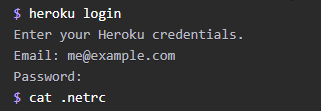
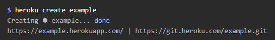
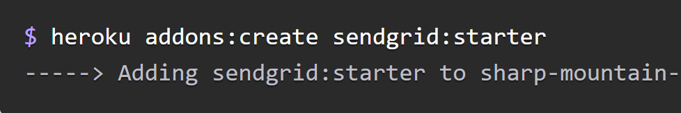
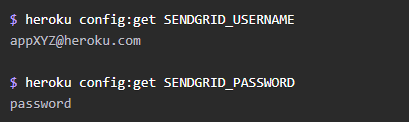
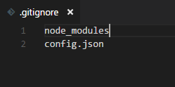

# nodemailer-heroku-sendgrid-tutorial
Tutorial for setting up nodemailer in heroku with sendrid.

# Getting Started with the Demo

 * Install dependencies ``` npm install ```
 * ``` npm start ```
 * open browser on port 3000

# Tutorial

This tutorial requires [Heroku](https://devcenter.heroku.com/articles/heroku-cli) and [Node.js](https://nodejs.org/en/download/) and an initialized [Github Repo](http://kbroman.org/github_tutorial/pages/init.html).

### Basic App Folder Structure
```App
 public
  --index.html
  --app.js
  --style.css
 .gitignore
 config.json
 server.js
 ```


### Log into Heroku and create

Run the ``` heroku login ``` command and enter your credentials



After loggin in, run the ``` heroku create <app name>``` command



### Attach Sendgrid to your heroku app

Run the ``` heroku addons:create sendgrid:starter ``` command



Run ``` heroku config:get SENDGRID_USERNAME ``` and ``` heroku config:get SENDGRID_PASSWORD ``` to get the SendGrid auth info.

**Make sure you keep this info safe somewhere, you're going to need for the next step.**

 

### Create config.json file

Create a config.json file, replace the 'user name' and 'password' strings with your sendgrid auth info. 

*config.json*
```json
{
"SENDGRID_USERNAME": "user name",
"SENDGRID_PASSWORD": "password"
}
```

### Create .gitignore file

Run ``` touch .gitignore ``` to create a .gitignore file

This .gitignore file will prevent git from sending certain files with sensitive / unnecessary information to github.

Go inside your .gitignore file and enter node_modules and config.json

**This step is very crucial, sendgrid will suspend your account if you push your sendgrid authentication info to github.**


### Set up server route

Run ``` npm install --save express body-parser nodemailer ``` to install your node modules. 

Set up server modules and their middleware
*server.js*
```javascript
const express = require('express');
const bodyParser = require('body-parser');
const nodeMailer = require('nodemailer');
const auth = require('./config.json');

const app = express();

const PORT = process.env.PORT || 3000;

//This is allowing the app to have access to my public folder
//This is also serving the index.html file to root '/' path, allowing the index.html file to be seen
app.use(express.static('./public'));

//This middleware allows our server routes to have parsed json data from the client
app.use(bodyParser.json({}));
app.use(bodyParser.urlencoded({ extended: true}));
app.use(bodyParser.text());

app.listen(PORT);
```

### Set up nodemailer 

First, we need to be able to grab our sensitive sengrid authentication info from the config.json file.

We also need to consider grabbing that info when our app is deployed. Since the .gitignore file will prevent the config.json file from being to pushed to github, our app will not have access to the info when deployed.

To fix this we need to grab the info from our environment variables.

Heroku automatically adds the sendgrid user name and password as environment variables, so all we have to do is use ```process.env.<environment variable>``` to access that info.

Here we set up the auth info using an if else statement, determining whether our app is deployed or not.

*server.js*
```javascript
const auth;

if(process.env.NODE_ENV === 'production'){
    auth = process.env;
}
else{
    auth = require('./config.json');
}
```

Now we need to configure nodemailer

*server.js*
```javascript
const transporter = nodemailer.createTransport({
  service: 'Sendgrid',
  auth: {
    user: auth.SENDGRID_USERNAME, pass: auth.SENDGRID_PASSWORD
  }
});
```

Create a route in your server to handle user input from the client and start using nodemailer.

*server.js*
```javascript
app.post('/sendEmail', (req, res)=>{
    let email = req.body.email;
    let message = req.body.message;
    let name = req.body.name;
    //Those ${} things that you see are called template literals
    //They are a way of inserting variables inside strings
    transporter.sendMail({
        from: '<your email>',
        to: email,
        subject: `Message from ${name}` ,
        html: `<h4>${message}</h4>`
        }, (err, info)=>{
            if(err){
                res.send(err);
            }
            else{
                res.status(200).json({
                success: true,
                message: 'Email Sent'
                });
            }
        });
});
```

Nodemailer is all set up, all that's left is the input form and post request.

Here's a simple input form, style yours as you please

*index.html*
```html
<form>
    <label>Name</label>
    <input type='text' id='name'/>
    <label>Email</label>
    <input type='text' id='email'/>
    <label>Message</label>
    <textarea id="message" class="materialize-textarea checkInput"></textarea>
    <button type='submit' id='submit'>Submit</button>
</form>
```

Using JQuery, we grab the input values and send a post request to our express route when the submit button is clicked. 

*app.js*
```js
$(document).on('click', '#submit', function(event){
    //This prevents the page from refreshing after the button click
    event.preventDefault(); 

    //Here we grab the input values
    let name = $('#name').val();
    let email = $('#email').val();
    let message = $('#message').val();
    
    //Here we trigger the post request, sending the input values
    $.post('/sendEmail', {
        name: name,
        email: email,
        message: message,
    })
    //When the post request finishes and sends back info
    //We clear the inputs and alert the email is on its way 
    .done((data)=>{
        if(data.success){
            $('#name').val('');
            $('#email').val('');
            $('#message').val('');
            alert('Email is on its way');
        }
    }); 
});
```

That's all you need to get started! 

After finishing your work, make sure to push everything up to github and run ```git push heroku master ``` to push up to heroku.


