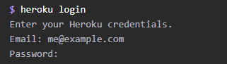
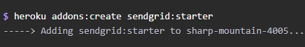

# nodemailer-heroku-sendgrid-tutorial
Tutorial for setting up nodemailer in heroku with sendrid.

# Getting Started

 * Install dependencies ``` npm install ```
 * ``` npm start ```
 * open browser on port 3000

# Tutorial

This tutorial requires [Heroku](https://devcenter.heroku.com/articles/heroku-cli) and [Node.js](https://nodejs.org/en/download/)

### Log into Heroku and create

Run the ``` heroku login ``` command and enter your credentials



After loggin in, run the ``` heroku create <app name>``` command


### Attach Sendgrid to your heroku app

Run the ``` heroku addons:create sendgrid:starter ``` command



Run ``` heroku config:get SENDGRID_USERNAME ``` and ``` heroku config:get SENDGRID_PASSWORD ``` to get the SendGrid auth info.
Make sure you keep this info safe somewhere, you're going to need it in a bit.


